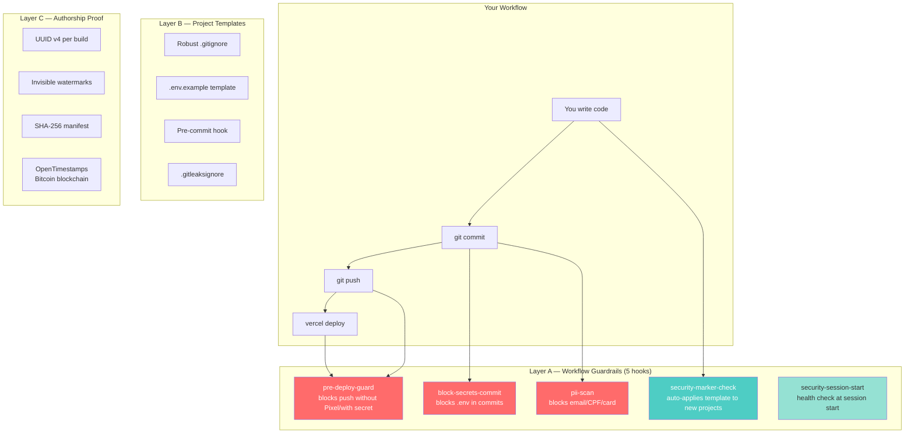
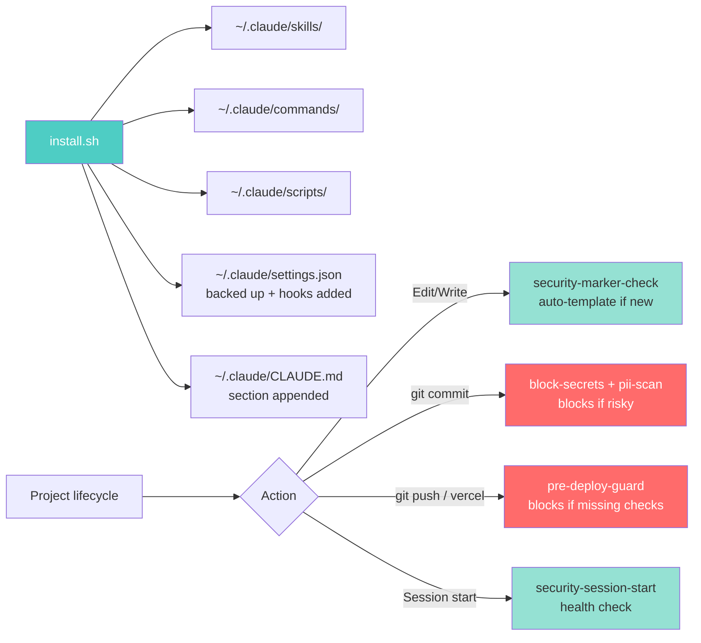

<div align="center">

# 🛡️ Claude Code Security Kit

### Production-grade security & IP protection for developers using Claude Code (and AI coding agents)

**5 automatic guardrails** · **Zero manual commands** · **Open source** · **$0/month**

[](LICENSE)
[](https://www.gnu.org/software/bash/)
[](https://nodejs.org/)
[](CONTRIBUTING.md)
[](CODE_OF_CONDUCT.md)

[**Quick Start**](#-quick-start-3-commands) ·
[**How It Works**](#%EF%B8%8F-how-it-works) ·
[**Comparison**](#-comparison-vs-alternatives) ·
[**FAQ**](#-faq) ·
[**Contributing**](CONTRIBUTING.md)

</div>

---

## 💡 Why this exists

You're using **Claude Code** (or Cursor, Copilot, any AI coding agent) and:

- 🚨 You once pushed a `.env` to GitHub and panicked
- 😰 You worry about leaking client emails, CPF, credit cards
- 🤖 Your AI agent might commit secrets without you noticing
- 📋 You copy-paste the same `.gitignore` from project to project, missing things
- ⚖️ You build LPs/apps and want to **prove authorship** if someone copies them
- 🔍 You don't want to think about security every commit — but you want it **always on**

This kit gives you **5 automatic guardrails** + **IP protection** that runs silently in the background. You write code, it watches your back.

> **Built initially for [Claude Code](https://claude.ai/code)** but works with any AI coding workflow that uses Bash, Git, and the standard developer toolchain.

---

## ⚡ Quick Start (3 commands)

Pre-requisites: `git`, `node 18+`, `python3`, `gitleaks` (optional but recommended), `gh CLI` authenticated.

```bash
# 1. Clone
git clone https://github.com/thidebrito/claude-code-security-kit.git ~/PROJETOS/claude-code-security-kit

# 2. Install (idempotent — safe to re-run)
cd ~/PROJETOS/claude-code-security-kit && bash install.sh

# 3. Restart Claude Code (or your AI agent) and you're protected
```

That's it. **You never need to run another command.** The kit takes over.

---

## 🛡️ What you get



### Layer A — 5 automatic hooks (Claude Code or any AI agent)

| Hook | When | Action |
|---|---|---|
| 🚫 `block-secrets-commit` | `git commit/add/push` | **Blocks** commit of `.env*` |
| 🚫 `pii-scan-hook` | `git commit` | **Blocks** commit with email/CPF/credit card |
| 🤖 `security-marker-check` | Editing files in your project folder | **Auto-applies** template if project is new (≤5 files, <60min old); else just **warns** |
| 🚫 `pre-deploy-guard` | `git push origin main` or `vercel deploy --prod` | **Blocks** push if Pixel ID missing or secret detected; **warns** if protection-manifest is stale |
| 🩺 `security-session-start` | Session start | Silent **health check**; flags unprotected projects |

### Layer B — Templates (no more copy-paste)

- 4 `.gitignore` flavors (universal, web, react, node) — 120-160 lines each
- `.env.example` template with common services documented (no values)
- Pre-commit hook (gitleaks + PII scan)
- `.gitleaksignore` template (suppress known false positives)

### Layer C — Authorship proof for public LPs/apps

Before deploying public landing pages or apps:

```bash
node scripts/protect-build.mjs ~/PROJETOS/your-project
# → Generates UUID, watermarks (HTML meta + JS + CSS), SHA-256 manifest
# → Stamps hash on Bitcoin blockchain via OpenTimestamps (free)
# → Saves .ots proof — legally admissible "this existed at this date"
```

If someone clones your LP later, you have **cryptographic + blockchain proof** of original authorship.

---

## 🏗️ How it works



### File structure after install

```
~/PROJETOS/claude-code-security-kit/      ← cloned repo
├── install.sh, update.sh                 ← lifecycle
├── scripts/
│   ├── apply-template.sh                 ← apply protection to project
│   ├── audit-projects.sh                 ← audit all projects in ecosystem
│   ├── secret-scan.sh, pii-scan.sh       ← scanners
│   ├── health-check.sh                   ← 24-check validation
│   ├── protect-build.mjs                 ← Layer C pipeline
│   └── vite-plugin-tdb-protect.mjs       ← Vite integration
├── templates/                            ← 7 reusable templates
└── claude-code-bundle/                   ← Claude Code files (skill, commands, hooks)

~/.claude/                                ← installed by install.sh
├── skills/seguranca-projeto/SKILL.md
├── commands/secure-{init,audit,protect}.md
├── scripts/{block-secrets-commit,pii-scan-hook,security-marker-check,pre-deploy-guard,security-session-start}.sh
├── settings.json                         ← hooks added (backup created)
└── CLAUDE.md                             ← section appended
```

---

## 📊 Comparison vs alternatives

| Feature | This kit | [Husky](https://typicode.github.io/husky/) | [Lefthook](https://github.com/evilmartians/lefthook) | [Trufflehog](https://github.com/trufflesecurity/trufflehog) | [GitGuardian](https://www.gitguardian.com/) |
|---|---|---|---|---|---|
| Open source | ✅ MIT | ✅ MIT | ✅ MIT | ✅ AGPL | ❌ Commercial |
| Cost | **$0** | $0 | $0 | $0 | $$$ |
| Pre-commit hooks | ✅ | ✅ | ✅ | ❌ | ✅ |
| Secret scanning | ✅ (gitleaks) | ❌ (config yourself) | ❌ (config yourself) | ✅ | ✅ |
| PII scanning (email/CPF/card) | ✅ | ❌ | ❌ | ❌ | ✅ |
| Auto-applies to new projects | ✅ **Unique** | ❌ | ❌ | ❌ | ❌ |
| Pre-deploy guard | ✅ | ❌ | ❌ | ❌ | ❌ |
| **IP authorship proof (blockchain)** | ✅ **Unique** | ❌ | ❌ | ❌ | ❌ |
| Watermarking | ✅ | ❌ | ❌ | ❌ | ❌ |
| Built for AI coding workflows | ✅ **Unique** | ❌ | ❌ | ❌ | ❌ |
| Templates included | ✅ | ❌ | ❌ | ❌ | ❌ |
| Idempotent install | ✅ | Partial | Partial | N/A | N/A |

**TL;DR:** Husky/Lefthook are git hook frameworks (you write rules). Trufflehog/GitGuardian are scanners. **This kit is a complete out-of-the-box system** with hooks + scanners + templates + IP proof, designed specifically for AI-assisted development.

---

## 🎯 Real-world use cases

### Use case 1 — "I push my code from Claude Code, sometimes with `.env` by accident"
→ Hook `block-secrets-commit` stops it. You see: `BLOCKED: tentativa de git add em arquivo .env`

### Use case 2 — "I have leads in CSV files, scared to commit one by mistake"
→ Hook `pii-scan-hook` blocks commits containing email/CPF/card patterns.

### Use case 3 — "I create new projects and forget to set up `.gitignore`"
→ When you (or Claude Code) edit a file in a brand new project (≤5 files, <60min old), the kit **auto-applies the template**. Project is born protected.

### Use case 4 — "I built a beautiful LP and want to protect IP if someone copies it"
→ `node scripts/protect-build.mjs ./your-project` adds invisible watermarks + Bitcoin blockchain timestamp. Cryptographic proof of authorship.

### Use case 5 — "I want to audit ALL my projects at once"
→ `bash scripts/audit-projects.sh` → JSON report with secrets in last 50 commits, missing `.gitignore`, etc.

---

## ❓ FAQ

<details>
<summary><b>Does this work without Claude Code?</b></summary>

The Layer A hooks are designed for Claude Code's `~/.claude/settings.json` hook system. But:

- **Layer B (templates, scripts):** work standalone in any environment
- **Layer C (protect-build):** plain Node.js, no Claude dependency
- **Layer A:** specific to Claude Code or compatible AI agents

PRs welcome to add adapters for Cursor, Copilot Workspace, etc.
</details>

<details>
<summary><b>Why blockchain timestamping? Sounds overkill.</b></summary>

[OpenTimestamps](https://opentimestamps.org/) is **free**, **decentralized**, and creates a permanent, tamper-proof record on Bitcoin. The hash of your build is anchored — even years later, you can prove it existed at a specific date.

Combined with watermarks (UUIDs, meta tags), this gives you **legally admissible authorship evidence** at zero cost.
</details>

<details>
<summary><b>Will hooks slow down my workflow?</b></summary>

- `block-secrets-commit`: <50ms
- `pii-scan-hook`: <100ms (regex on staged diff)
- `security-marker-check`: <20ms
- `pre-deploy-guard`: 50ms-2s (depends on if gitleaks runs)
- `security-session-start`: <2s (one-time per session)

You won't notice them. They run in the background.
</details>

<details>
<summary><b>What if a hook blocks something I legitimately need to commit?</b></summary>

Bypass keys (use sparingly):

```bash
SKIP_HOOKS=1 git commit -m "..."          # bypass pre-commit
SKIP_PREDEPLOY=1 git push origin main      # bypass pre-deploy
export SECURITY_MARKER_SKIP=1              # silence warnings for session
export SECURITY_NO_AUTOAPPLY=1             # disable auto-template
```

If you bypass often, the hook needs improvement — open an issue.
</details>

<details>
<summary><b>Do I need to install anything besides this kit?</b></summary>

Required: `git`, `node 18+`, `python3` (already on macOS/Linux usually)
Recommended: `gitleaks` (`brew install gitleaks` on macOS), `gh CLI`

`install.sh` checks all of this and tells you what's missing.
</details>

<details>
<summary><b>Why doesn't it include JavaScript obfuscation?</b></summary>

Conscious decision. Obfuscation:
- Risks breaking real-world integrations (Pixel Meta, payment SDKs, Supabase clients)
- Provides marginal protection (any motivated dev can de-obfuscate)
- Costs you debuggability in production

Watermarks + UUID + blockchain hash give 90% of the IP protection at 0% of the breakage risk. Obfuscation may come as opt-in plugin in v2.
</details>

<details>
<summary><b>Can I use this on Linux / Windows (WSL)?</b></summary>

- macOS: ✅ fully tested
- Linux: ✅ should work (uses Bash, standard Unix tools)
- Windows: ⚠️ via WSL only (native Windows shell not supported)

Report issues with platform tags so we can fix.
</details>

<details>
<summary><b>How do I update?</b></summary>

```bash
cd ~/PROJETOS/claude-code-security-kit
bash update.sh
```

Pulls latest from GitHub and re-runs `install.sh` (idempotent).
</details>

<details>
<summary><b>Is this maintained?</b></summary>

Yes — initial author actively uses it daily across 25+ projects. PRs and issues are reviewed.

If you find this useful, **star the repo** so others discover it. ⭐
</details>

---

## 📚 Documentation

| Doc | Topic |
|---|---|
| [docs/ARCHITECTURE.md](docs/ARCHITECTURE.md) | The 4-layer architecture in depth |
| [docs/INSTALLATION.md](docs/INSTALLATION.md) | Detailed install + manual fallback |
| [docs/HOOKS.md](docs/HOOKS.md) | Each hook explained |
| [docs/COMMANDS.md](docs/COMMANDS.md) | `/secure-*` commands reference |
| [docs/TEMPLATES.md](docs/TEMPLATES.md) | Templates included |
| [docs/PROTECT-BUILD.md](docs/PROTECT-BUILD.md) | Layer C — IP protection deep dive |
| [docs/COMPARISON.md](docs/COMPARISON.md) | vs alternatives (extended) |
| [docs/FAQ.md](docs/FAQ.md) | Extended FAQ |
| [docs/playbooks/rotate-credentials.md](docs/playbooks/rotate-credentials.md) | Incident response: rotating leaked credentials |

---

## 🤝 Contributing

PRs welcome! See [CONTRIBUTING.md](CONTRIBUTING.md).

Quick wins for first-time contributors:
- Add Linux-specific install instructions
- Add adapter for Cursor / Copilot Workspace
- Translate docs (currently English + Portuguese)
- Improve hooks (lower false positive rate in `pii-scan`)
- Build dashboard (HTML static page showing security status)

---

## 🛡️ Security

If you find a security vulnerability, please **don't open a public issue**. See [SECURITY.md](SECURITY.md) for responsible disclosure.

---

## 📄 License

MIT © Contributors. See [LICENSE](LICENSE).

---

## 🙏 Acknowledgments

- [Claude Code](https://claude.ai/code) by Anthropic — the AI coding agent this kit was built for
- [gitleaks](https://github.com/gitleaks/gitleaks) — secret scanning engine
- [OpenTimestamps](https://opentimestamps.org/) — free Bitcoin blockchain timestamping
- The "vibe coding" community pushing AI-assisted development forward

---

<div align="center">

### ⭐ If this kit saved you from leaking a secret, star the repo and tell a friend

[**Report an issue**](../../issues/new) ·
[**Request a feature**](../../issues/new) ·
[**Discussions**](../../discussions)

Made with care for developers who care about security.

</div>
