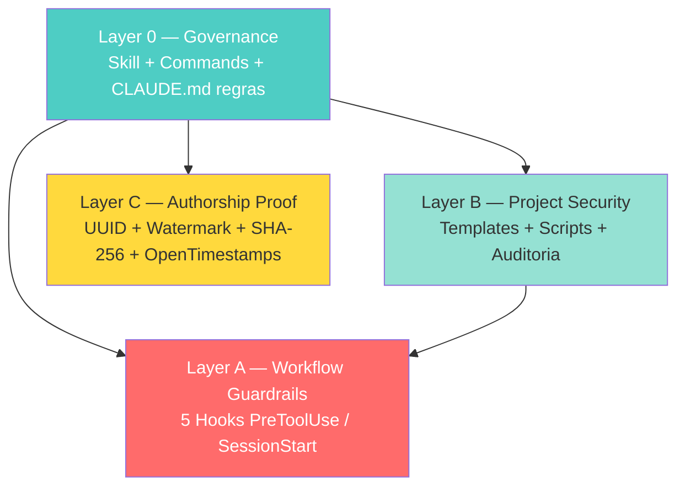
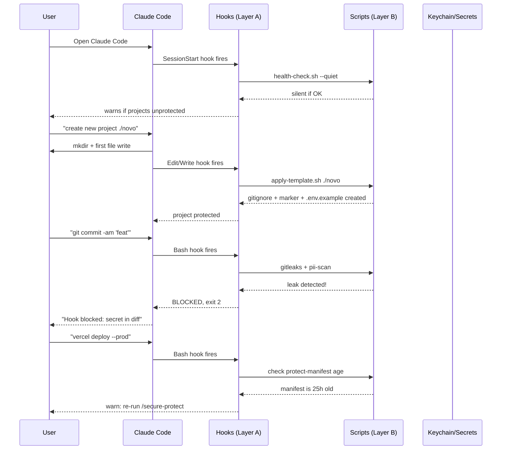

# Architecture — 4 Layers

The kit is organized in 4 independent layers. Each layer protects against different risks and can be used standalone.

## Layer 0 — Governance (Always-On Orchestration)

**Purpose:** make sure all other layers are *applied automatically*, not forgotten.

**Components:**
- **Skill `seguranca-projeto`** in `~/.claude/skills/` — always-on, instructs Claude how to behave
- **Commands `/secure-init`, `/secure-audit`, `/secure-protect`** in `~/.claude/commands/` — manual triggers (rarely needed since hooks fire automatically)
- **`~/.claude/CLAUDE.md` rules** — global rules (#11, #12) that Claude reads on every session

**Without Layer 0:** the other layers exist as scripts but require manual invocation. With Layer 0, they activate themselves.

## Layer B — Project Security (Templates + Scanning)

**Purpose:** every project, new or existing, gets a robust baseline.

**Components:**
- **Templates** (`templates/`):
  - `gitignore.universal` — base for any project
  - `gitignore.web` — adds HTML/CSS/JS extras
  - `gitignore.react` — adds Vite/Next/cache
  - `gitignore.node` — adds backend/serverless
  - `env.example.template` — common services documented (no values)
  - `pre-commit.sh.template` — git hook running scanners
  - `gitleaksignore.template` — false positive suppression
  - `security-applied.template.json` — marker file
- **Scripts** (`scripts/`):
  - `apply-template.sh` — apply to project (auto-detects type)
  - `audit-projects.sh` — audit entire ecosystem
  - `secret-scan.sh` — gitleaks wrapper
  - `pii-scan.sh` — regex for email/CPF/CNPJ/credit card
  - `health-check.sh` — 24-check validation
- **Playbooks** (`docs/playbooks/`):
  - `rotate-credentials.md` — incident response

**Without Layer B:** every project starts from scratch — high chance of inconsistent `.gitignore`, missed `.env`.

## Layer A — Workflow Guardrails (Hooks)

**Purpose:** prevent dangerous AI agent behaviors *before* they happen.

**5 hooks** in `~/.claude/scripts/`, configured in `~/.claude/settings.json`:

| Hook | Trigger | Behavior |
|---|---|---|
| `block-secrets-commit.sh` | `PreToolUse Bash` matcher `git commit/add/push` | Blocks commit of `.env*` files |
| `pii-scan-hook.sh` | `PreToolUse Bash` matcher `git commit` | Blocks commit with PII in diff |
| `security-marker-check.sh` | `PreToolUse Edit/Write` in user projects | Auto-applies template if new project, warns otherwise |
| `pre-deploy-guard.sh` | `PreToolUse Bash` matcher `git push origin main` or `vercel deploy --prod` | Blocks push without Pixel/with secret; warns if protect-manifest stale |
| `security-session-start.sh` | `SessionStart` startup\|resume | Silent health check + flags unprotected projects |

**Without Layer A:** templates exist but the AI agent (or you) might still commit secrets or deploy without checks.

## Layer C — Authorship Proof (IP Protection)

**Purpose:** for *public* projects (LPs, blogs, apps), generate cryptographic evidence of authorship.

**Components:**
- `scripts/protect-build.mjs` — pipeline:
  1. Generate UUID v4 unique per build
  2. Inject invisible watermarks (HTML meta tags, JS oculto, CSS comments)
  3. Calculate SHA-256 of every file in `dist/`
  4. Create `protection-manifest.json`
  5. Stamp manifest hash on Bitcoin blockchain via OpenTimestamps
  6. Save `.ots` proof in `timestamps/`
- `scripts/vite-plugin-tdb-protect.mjs` — Vite plugin (auto-runs on `vite build`)
- `scripts/pre-deploy.sh` — wrapper for plain HTML projects

**Decisions consciously NOT included:**
- ❌ JavaScript obfuscation (risks breaking integrations like Pixel Meta, Hotmart)
- ❌ GPG signing (OpenTimestamps + SHA-256 = 90% of legal value, 0% setup overhead)

**Without Layer C:** if someone clones your LP and publishes as their own, you have only `git log` (private) — no public/legal proof.

---

## Data flow

---

## Why this architecture?

### Separation of concerns
Each layer has a single responsibility. You can use Layer B alone (templates) without Layer A (hooks) if you don't use Claude Code.

### Idempotent everywhere
`install.sh`, `apply-template.sh`, `update.sh` — all safe to re-run. No state corruption.

### Open standards
- gitleaks (industry standard for secret scanning)
- OpenTimestamps (W3C blockchain standard)
- Bash + Node.js (universal runtimes)

### Privacy by default
- All scanning runs locally (no cloud, no telemetry)
- gitleaks uses `--redact` (secrets never leave your machine)
- Pre-commit hooks block before secrets reach Git, let alone GitHub

### Reversible
- `install.sh` creates backup of `settings.json`
- All file modifications can be reverted via `git revert`
- Bypass env vars (`SKIP_HOOKS=1`) for emergencies
