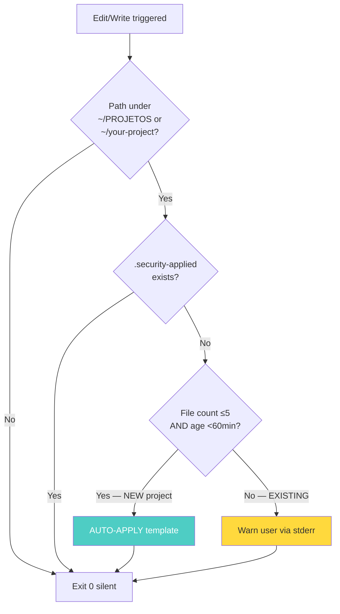
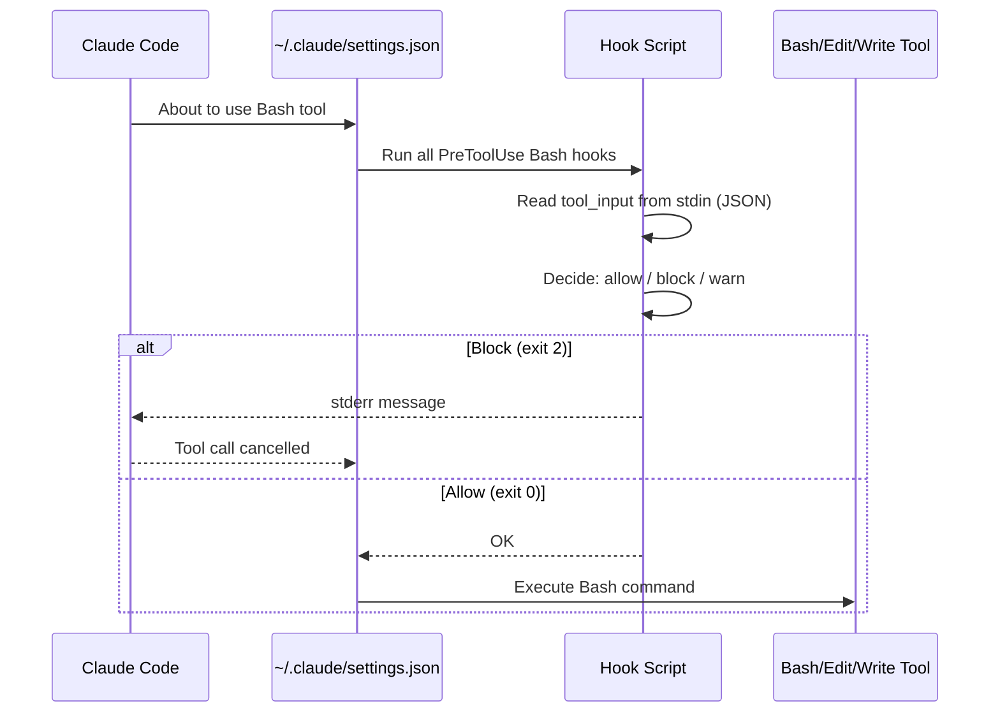

# Hooks Reference

The kit installs 5 hooks in Claude Code's `~/.claude/settings.json`. Each hook runs at a specific lifecycle event and either **blocks** (exit 2) or **warns** (stderr, exit 0) when it detects a problem.

---

## 1. `block-secrets-commit.sh`

**Trigger:** `PreToolUse` Bash matcher `git commit/add/push`

**What it blocks:**
- `git add .env` (or `.env.local`, `.env.production`, etc. — except `.env.example`)
- `git commit -a` if `.env*` files are modified
- `git push` if last commit contains `.env*` files

**Output on block:**
```
BLOQUEADO: tentativa de git add em arquivo .env (potencial leak de secrets).
Use .env.example para templates.
```

**Bypass:**
```bash
SKIP_HOOKS=1 git commit -m "..."
```

---

## 2. `pii-scan-hook.sh`

**Trigger:** `PreToolUse` Bash matcher `git commit`

**What it blocks:**
- Email addresses in diff (excluding allowlisted: `example.com`, `noreply@`, `test@`)
- CPF (Brazilian tax ID) in `XXX.XXX.XXX-XX` format
- CNPJ (Brazilian company ID) in `XX.XXX.XXX/XXXX-XX` format
- Credit card numbers (4 groups of 4 digits with spaces/dashes)
- Brazilian phone numbers (with parentheses or dashes)

**Allowlists:**
- File path patterns: `.example`, `.template`, `/tests/`, `/fixtures/`, `node_modules/`, `dist/`
- Content patterns: `example.com`, `noreply@`, `test@`, `placeholder`, `XXXX`, `0000`

**Output on block:**
```
🔐 [pii-scan] Modo: STAGED
  ⚠️  EMAIL: src/leads.csv: cliente@empresa.com
❌ pii-scan: PII DETECTADA — revisar e ofuscar antes de commitar/publicar
```

**Bypass:**
```bash
SKIP_HOOKS=1 git commit -m "..."
```

---

## 3. `security-marker-check.sh`

**Trigger:** `PreToolUse` Edit/Write in `~/PROJETOS/*/` or `~/your-project/`

**Behavior (smart):**



**Auto-apply heuristic:** if folder has ≤5 files AND was created in the last 60 min, the kit assumes it's a freshly-created project and applies the template automatically (no prompt).

**Bypasses:**
```bash
export SECURITY_MARKER_SKIP=1     # silence everything
export SECURITY_NO_AUTOAPPLY=1     # warn-only mode (never auto-apply)
```

---

## 4. `pre-deploy-guard.sh`

**Trigger:** `PreToolUse` Bash matcher `git push origin main` OR `vercel deploy --prod`

**What it blocks:**
1. `git push origin main` if a staged HTML file looks like a landing page (`fbq('init')`, `<title>...landing</title>`, etc.) but doesn't have your Pixel ID configured
2. Push if known secret patterns detected in diff (AKIA, sk_live_, ghp_, AIza, xoxb-, etc.)

**What it warns about (doesn't block):**
- Public project with `.security-applied` but no `protection-manifest.json` → recommend running `/secure-protect`
- Public project with manifest older than 24h → recommend re-running

**Output on block:**
```
❌ BLOQUEIO: Push pra main interrompido
   Arquivo: index.html
   Motivo: parece ser LP/página de produto mas não tem Pixel Meta YOUR_META_PIXEL_ID
   Solução: adicione o pixel OU remova arquivo do commit
   Bypass: SKIP_PREDEPLOY=1 git push origin main
```

**Bypass:**
```bash
SKIP_PREDEPLOY=1 git push origin main
SKIP_HOOKS=1 git push origin main
```

---

## 5. `security-session-start.sh`

**Trigger:** `SessionStart` matcher `startup|resume`

**What it does:**
1. Runs `health-check.sh --quiet` (silent if all 24 checks pass)
2. Lists projects under `~/PROJETOS/*` and `~/your-project/` that lack `.security-applied`

**Performance:** <2 seconds (uses `gtimeout` if available)

**Output (only if something needs attention):**
```
🚨 [security] Health-check do sistema reportou problema: ...

⚠️  [security] 3 projeto(s) SEM proteção:
   - lp-cliente-x
   - novo-quiz
   - app-teste
   → Aplicar em todos: for p in lp-cliente-x novo-quiz app-teste; do bash ...
```

**Bypass:**
```bash
export SECURITY_SESSION_SILENT=1
```

---

## Customizing hooks

All hooks are plain Bash. To customize:

1. Edit `~/.claude/scripts/<hook-name>.sh`
2. Test manually: `echo '{}' | bash ~/.claude/scripts/<hook-name>.sh`
3. Restart Claude Code (or it picks up next `git commit`)

If you want to **share your customization**, copy the modified hook to `~/PROJETOS/claude-code-security-kit/claude-code-bundle/scripts/`, commit, and PR.

---

## Hook execution model



Each hook receives JSON input on stdin like:
```json
{
  "tool_input": { "command": "git commit -m '...'" },
  "cwd": "/Users/you/PROJETOS/your-project"
}
```

Returns:
- `exit 0` → allow
- `exit 2` → block (stderr message shown to Claude and user)
- Any stderr output → shown as warning (but doesn't block unless exit 2)

---

## Disabling specific hooks

To disable a hook permanently, edit `~/.claude/settings.json` and remove the entry under `hooks.PreToolUse` or `hooks.SessionStart`. Or rename the script (e.g., `mv block-secrets-commit.sh block-secrets-commit.sh.disabled`).

For temporary disable, use the bypass env vars documented per hook.
