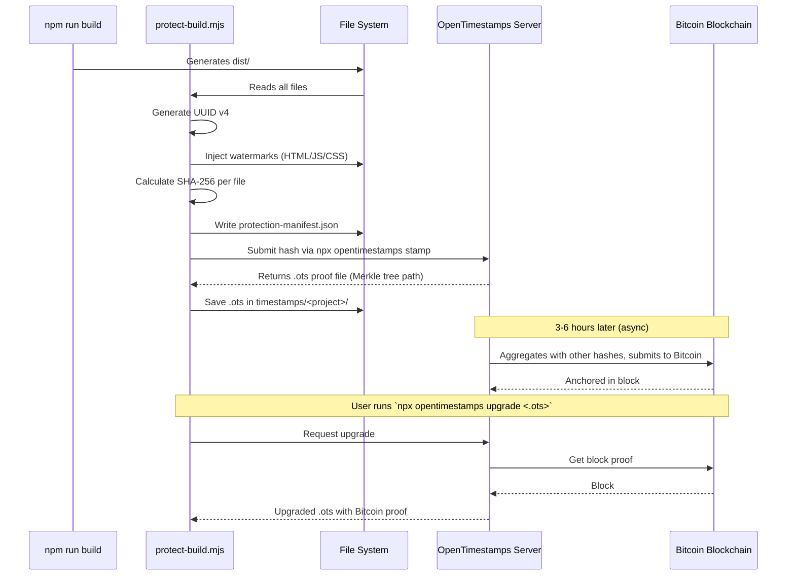

# Layer C — Authorship Proof Pipeline

Deep dive into `protect-build.mjs` — the IP protection pipeline.

## What problem this solves

You build a beautiful landing page. You ship it. A few weeks later, you find someone copied your design + code and claims it's theirs. What's your proof of original authorship?

Without this kit:
- `git log` is private (proves nothing publicly)
- Wayback Machine (slow indexing, may not capture in time)
- Site screenshots (forgeable)

With this kit:
- **Cryptographic hash** of your build, anchored on Bitcoin blockchain
- **Invisible watermarks** in HTML/JS/CSS that survive copy-paste
- **Versioned `.ots` proof file** — open it in any OpenTimestamps client to verify
- **Manifest** with build UUID, date, author, file hashes — court-admissible

## Pipeline overview



## Watermarking strategy

### HTML — meta tags
Injected immediately after `<head>`:
```html
<head>
  <!-- TDB-AUTHENTICITY: a3f9c2e18b740b3f -->
  <meta name="x-author" content="Your Name">
  <meta name="x-author-id" content="a3f9c2e1-9b04-4c3d-bf21-1234567890ab">
  <meta name="x-built-at" content="2026-05-06T22:30:00.000Z">
  <meta name="x-canonical-source" content="yourdomain.com">
  ...
```

**Survives:** view-source copy, file download, automated cloners.
**Stripped by:** intentional dev removal (visible in HTML), aggressive minifiers (rare for meta tags).

### JavaScript — base64 string
Appended to every `.js`/`.mjs`:
```js
;(function(){try{window.__TDB__=atob("WW91ciBOYW1lfDIwMjYtMDUtMDZ8YTNmOWMyZTE=");}catch(e){}})();
```

**Survives:** minification (the string survives), basic obfuscation, copy-paste.
**Stripped by:** dead-code elimination tools that detect unused expressions, intentional removal.

### CSS — comment header
Prepended to every `.css`:
```css
/* © Your Name · 2026-05-06 · uuid:a3f9c2e1 · yourdomain.com */
.your-styles { ... }
```

**Survives:** minification (most minifiers preserve `/*!` legal comments — adjust if needed).
**Stripped by:** aggressive CSS minifiers (cssnano with default config strips comments).

## SHA-256 manifest

`protection-manifest.json` (placed in `dist/`):
```json
{
  "schema": "thidebrito-security/protection-manifest/1.0.0",
  "project": "my-landing-page",
  "build_uuid": "a3f9c2e1-9b04-4c3d-bf21-1234567890ab",
  "built_at": "2026-05-06T22:30:00.000Z",
  "author": "Your Name",
  "canonical_source": "yourdomain.com",
  "files_count": 12,
  "files_total_bytes": 1234567,
  "aggregate_sha256": "9f8d7e6c5b4a3e2f1d0c9b8a7f6e5d4c3b2a1f0e9d8c7b6a5f4e3d2c1b0a9f8e",
  "watermarks": {
    "html_meta": true,
    "js_base64": true,
    "css_comment": true
  },
  "files": [
    { "path": "index.html", "bytes": 24890, "sha256": "..." },
    { "path": "assets/main.js", "bytes": 145234, "sha256": "..." },
    ...
  ],
  "ots_proof": "timestamps/my-landing-page/2026-05-06_2230_a3f9c2e1.json.ots"
}
```

The `aggregate_sha256` is the hash that gets stamped on the blockchain. If anyone modifies even one byte of any file, this hash changes.

## OpenTimestamps deep dive

OpenTimestamps is a free, decentralized timestamping protocol that anchors hashes to Bitcoin's blockchain.

**Why Bitcoin?**
- Immutable: rewriting history requires majority of global mining power (impossible practically)
- Public: anyone can verify
- Free: aggregation makes per-stamp cost ~0

**Process:**
1. Your hash is submitted to a calendar server (e.g., `calendar.opentimestamps.org`)
2. The server aggregates hashes from many submitters into a Merkle tree
3. The Merkle root is included in a Bitcoin transaction
4. Within 3-6 hours, the transaction is confirmed in a Bitcoin block

**Verifying a stamp:**
```bash
# Anyone can run this — only needs the .ots file + original file
npx opentimestamps verify protection-manifest.json
```

Output:
```
Calendar https://...: success!
Bitcoin block 825234 attests existence as of 2026-05-06 14:30 UTC
```

This is your proof. Cryptographically tied to Bitcoin block 825234.

## Vite plugin integration

For Vite-based projects, add to `vite.config.ts`:

```typescript
import { defineConfig } from 'vite';
import react from '@vitejs/plugin-react';
import tdbProtect from '~/PROJETOS/claude-code-security-kit/scripts/vite-plugin-tdb-protect.mjs';

export default defineConfig({
  plugins: [
    react(),
    tdbProtect({
      enabled: process.env.NODE_ENV === 'production',
      skipTimestamp: false,  // set true in dev/CI
      distDir: 'dist',
      verbose: false,
    }),
  ],
});
```

The plugin runs in Vite's `closeBundle` hook (after build completes). On dev (`vite dev`), it's bypassed.

## Plain HTML (no Vite)

For plain HTML/CSS/JS projects:

```bash
# Manual:
node ~/PROJETOS/claude-code-security-kit/scripts/protect-build.mjs ./

# Or via wrapper (recommended for `vercel.json`):
"buildCommand": "bash $HOME/PROJETOS/claude-code-security-kit/scripts/pre-deploy.sh"
```

## Verification workflow (after dispute)

If you find someone has copied your project:

1. **Identify the suspect site** — note URL
2. **Inspect their HTML** — look for your `x-author-id` meta tag (often forgotten)
3. **Get your `.ots` proof** — `~/PROJETOS/claude-code-security-kit/timestamps/<project>/<date>_<uuid>.json.ots`
4. **Verify your stamp**:
   ```bash
   npx opentimestamps verify protection-manifest.json
   ```
5. **Document the comparison** — your manifest's `built_at` vs suspect's earliest WHOIS/Wayback record
6. **Consult legal counsel** with the proof package

Total time to gather: <30 minutes if you ran `protect-build.mjs` before deploy.

## Limitations (be honest)

- ❌ **Doesn't protect against design copying** — only the implementation. If they redesign from scratch, watermarks won't survive.
- ❌ **Watermarks can be stripped** — by determined attackers. They're deterrents, not barriers.
- ❌ **Bitcoin anchoring takes time** — 3-6h for confirmation, ~6 confirmations (1h) recommended for high-stakes proof
- ❌ **Doesn't preserve old versions** — only what you stamp at build time. Use Git for version history.
- ❌ **Legal jurisdiction matters** — blockchain evidence acceptance varies by country. Consult lawyer.

## Frequency recommendations

| Project type | When to run `protect-build` |
|---|---|
| Production LP/blog | Every deploy |
| App/PWA | Every release |
| Internal tool | Not needed |
| Open source | Not needed (license is your protection) |
| Client work | Every deploy + give client the `.ots` |
