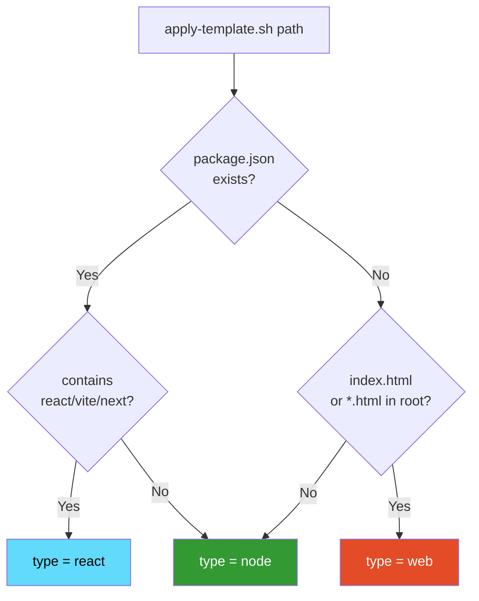

# Templates Reference

The kit ships with **7 templates** in `templates/`. Apply via `apply-template.sh` or use directly.

| Template | Lines | Purpose |
|---|---|---|
| `gitignore.universal` | ~60 | Base for any project (`.env*`, secrets, OS, IDEs, logs, backups) |
| `gitignore.web` | +25 | HTML/CSS/JS plain projects (Vercel/Netlify, source maps, image cache) |
| `gitignore.react` | +50 | Vite, Next.js, Nuxt, Svelte (build/, .next/, .vite/, etc.) |
| `gitignore.node` | +40 | Backend, serverless, MCP servers (Lambda cache, runtime artifacts) |
| `env.example.template` | ~30 | Common services documented (Supabase, Hotmart, Meta, Resend, Vercel) — no values |
| `pre-commit.sh.template` | ~50 | Git hook running gitleaks + pii-scan |
| `gitleaksignore.template` | ~25 | Suppress known false positives with fingerprints |
| `security-applied.template.json` | ~16 | Marker JSON for audited projects |

## Auto-detection logic (in `apply-template.sh`)



You can override with `--type` flag:
```bash
bash scripts/apply-template.sh ~/PROJETOS/myproject --type react
```

## Manual application

If you don't want to use `apply-template.sh`, copy templates manually:

```bash
KIT=~/PROJETOS/claude-code-security-kit

# Universal + react flavor
cat $KIT/templates/gitignore.universal > .gitignore
echo "" >> .gitignore
cat $KIT/templates/gitignore.react >> .gitignore

# Env template
cp $KIT/templates/env.example.template .env.example

# Pre-commit hook (only if Git repo)
cp $KIT/templates/pre-commit.sh.template .git/hooks/pre-commit
chmod +x .git/hooks/pre-commit

# Marker
cp $KIT/templates/security-applied.template.json .security-applied
# Edit applied_at, applied_by manually
```

## Customizing templates

The templates are intentionally **opinionated but reasonable**. To customize:

1. Fork this repo
2. Edit the `templates/` files
3. Re-run `install.sh` to propagate to your local
4. (Optional) PR back if useful for everyone

### Common customizations

**Add your monorepo structure to `gitignore.universal`:**
```
# ── Monorepo specific ─────────
packages/*/dist/
apps/*/.next/
```

**Add your team's services to `env.example.template`:**
```
# === Internal services ========
INTERNAL_API_URL=
INTERNAL_API_KEY=
```

**Make pre-commit stricter:**
```bash
# In pre-commit.sh.template, add:
# Lint check
if command -v npm >/dev/null && [ -f package.json ]; then
  npm run lint --silent || { echo "❌ Lint failed"; exit 1; }
fi
```

## Template versioning

Templates carry a comment header with version:
```
# Versão: 1.0.0 (YYYY-MM-DD)
```

When you apply a template, the version is recorded in `.security-applied`. This lets you detect drift later:

```bash
# Check which templates are outdated:
for proj in ~/PROJETOS/*/; do
  if [ -f "$proj/.security-applied" ]; then
    VERSION=$(grep "security_repo_version" "$proj/.security-applied" | cut -d'"' -f4)
    echo "$proj: $VERSION"
  fi
done
```

## What templates DON'T cover

- **Project-specific build outputs** — add manually if you have unusual paths
- **Personal IDE settings** — `.idea/`, `.vscode/` are partially covered (workspace settings ignored, extensions list shared)
- **Test artifacts** — covered for Jest/Vitest defaults; customize if you use other frameworks
- **Database files** — covered for SQLite (`.sqlite`, `.db`); customize for other engines
